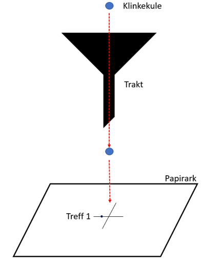

# Variasjon

Vi skal tilnærme oss begrepet variasjon gjennom å vise til et velkjent eksperiment – «The Funnel Experiment», eller trakteksperimentet som vi kan kalle det på norsk. Hensikten med trakteksperimentet var å vise at dersom vi ikke forstår variasjon, og introduserer korrigerende tiltak i prosesser som ikke trenger det, står vi i fare for å forverre resultatet (og ofte ha brukt mye tid og ressurser på å justere prosessen i den tro at resultatet vil bli bedre). Eksperimentet illustrerer at mange tiltak i organisasjoner for å «rette på feil» eller «forbedre kvaliteten» ender opp med å ha motsatt virkning.

Trakteksperimentet ble popularisert av @Deming1986 for å beskrive de negative effektene prosessendringer kan ha hvis man ikke forstår årsakene til variasjonen i resultatene (Deming krediterer selv Lloyd Nelson for å ha designiet ekseperimentet, og enkelte kilder omtaler derfor dette som "the Deming-Nelson funnel experiment" [@georgantzasTamperingDynamics2003] . I trakteksperimentet lar vi en klinkekule falle gjennom en trakt vi har sentrert rett over et mål. Der kula treffer arket setter vi et merke. Kula vil aldri treffe nøyaktig på målet og aldri nøyaktig på samme sted fra gang til gang. 

La oss si at vi slipper kula gjennom trakta første gang. Trakta er plassert slik at senterlinja gjennom trakta treffer nøyaktig midt i målet. Så slipper vi kula og registerer treffpunktet. 

Deretter bruker vi 1 av 4 regler for korreksjon for å justere prosessen for å forsøke å få kula til å treffe nærmere målet (se f.eks. [@sparksUsingDemingFunnel2000]. 

**Regel 1**
Ingen justering. Selv om kula ikke treffer målet fortsetter vi med neste forsøk uten å gjøre noen justeringer. Vi holder trakta på nøyaktig samme sted. 

**Regel 2**
Trakta justeres etter forrige treffpunkt (treff 1). Hvis kula treffer i z avstand fra målets senterpunkt vil trakta justeres med -z før neste forsøk.

Så gjentar vi prosessen og korrigerer trakta fra traktas forrige posisjon etter hvert treffpunkt ut fra kulas avstand fra det nye treffpunktet til målets senterpunkt. Justering av trakta skjer etter følgende metode: Plassering av trakta starter i målsenteret (0,0) og justeres deretter slik at ny plassering blir målsenteret blir minus offset (retning og avstand) for forrige kule fra treffpunkt til målsenteret. 

@sparksUsingDemingFunnel2000 beskriver regelen slik: "At drop *i* (*i* = 1,2,3, .) the marble will come to rest at point y~i~, measured from the target. (In other words, y~i~ is the error at drop *i*.) Move the funnel the distance -*y*~i~ from its last position to aim for the next drop."

@Deming1986 gir noen eksempler på bruk av regel 2: feedback-mekanismer som reagerer på enkelttilfeller, endring av en policy, rutine e.l. på bakgrunn av (kun) siste kundeundersøkelse, bruke variasjon/avvik til å lage budsjetter og vurdering av en aksje basert på forrige måneds underskudd.

**Regel 3**
Her registrerer vi treff 1 som i regel 2. Vi flytter trakta til et punkt nøyaktig motsatt av det punktet kula fikk. Vi beregner offset for kula på samme måte som i regel 2 – retning og avstand fra målsenteret til kulas treffpunkt. Før vi justerer flytter vi imidlertid trakta tilbake til (0,0) og justerer derfra (i motsetning til regel 2 da vi ikke flyttet trakta til (0,0) før vi begynte korreksjonen, men i stedet foretok justeringen fra det punktet trakta befant seg da kula ble sluppet). Her eksemplifiserer @Deming1986 ved å vise til hvordan mer effektiv narkotikabekjempelse fører til høyere priser på narkotika som stimulerer til smugling av mer narkotika, eller en gambler som høyner innsatsen for å dekke forrige tap.

@sparksUsingDemingFunnel2000 beskriver regelen slik: "At drop *i* the marble comes to rest at point *y*~i~ from the target, then for the next drop aim the funnel over the point -*y*~i~ from the target."

**Regel 4**
Her flytter vi trakta hele tiden til siste treffpunkt og slipper ny kule der. Her viser @Deming1986 til eksempler som den kjente «hviskeleken» der et antall personer sitter i en ring og gjenforteller en historie ved å hviske den til neste person, som igjen hvisker den til neste osv til den kommer til siste person som forteller historien vedkommende nettopp hørte. Historien som til slutt blir fortalt er som regel ganske annerledes enn den opprinnelige. Et annet eksempel kan være produksjon av en gjenstand basert på forrige produserte gjenstands mål.

@sparksUsingDemingFunnel2000 beskriver regelen slik: "At drop *i* the marble comes to rest at point *y*~i~ from the target, then for the next drop aim the funnel over the spot *y*~i~ where the marble last came to rest."

En kort og instruktiv video [@Crostic2015] om gjennomføringen av trakteksperimentet vises kan dere se her: 

